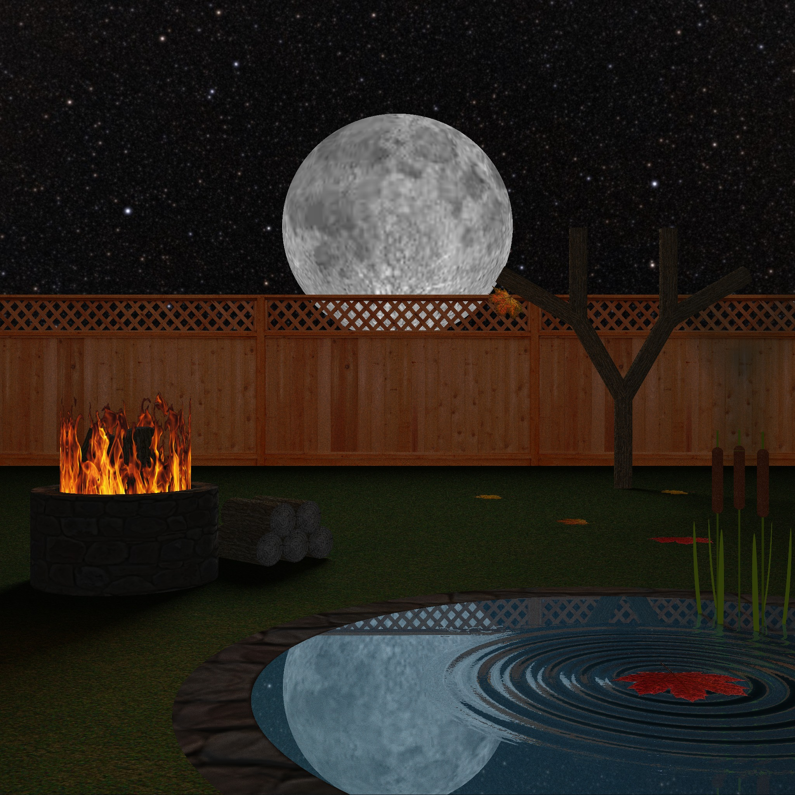
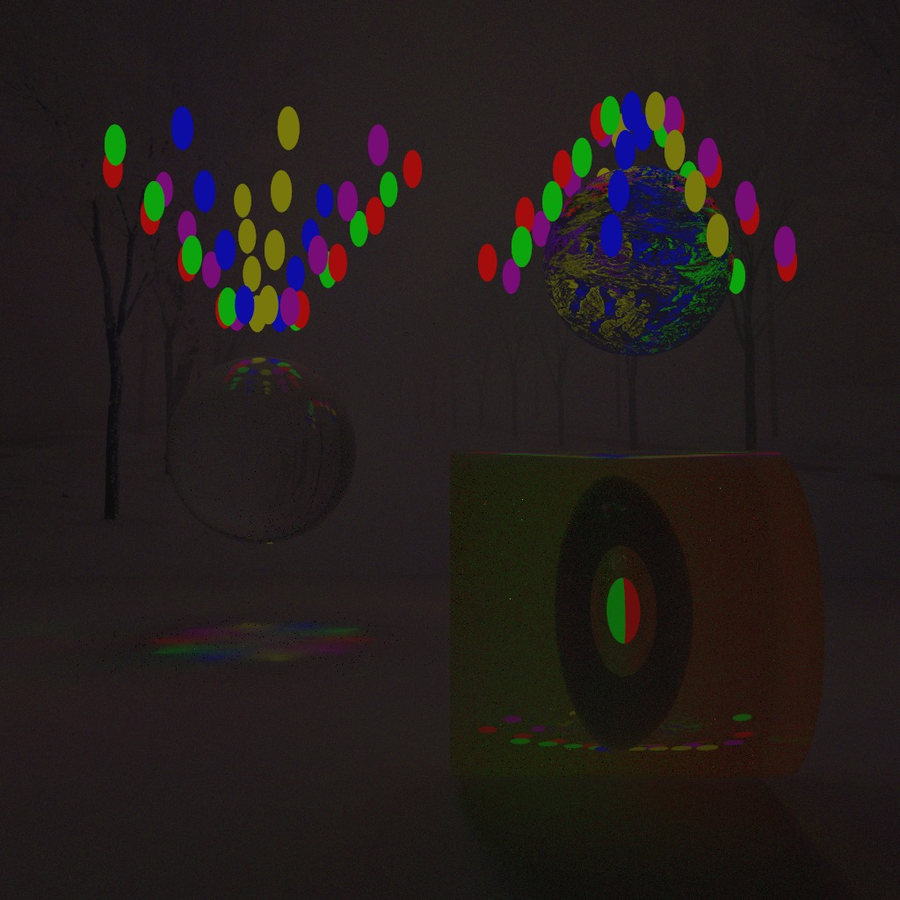

In this class we learned about how to accurately create computer generated images that involve light. We first looked at how light interacts with objects differently according to the position of the object in the scene and the properties of the object. We also looked at what happens when light is hits a camera lens or eye to be able to simulate it as close to the real thing as possible. Throughout the course we built an advanced ray tracer and a path tracer which helped to show the pros and cons of both of the two different rendering techniques. In order to truly simulate light in a scene we should shoot light rays in every direction from the light; however, if we did this, most of the rays of light would be bounced into space and never reach the camera or eye. These wasted rays cost significant computational power, so in order to avoid the wasted computations we shoot rays from the camera, this is handled differently in ray and path tracing which leads to the shortcuts that are necessary to take so that the image will render in a reasonable amount of time while trying not to sacrifice image quality or realistic effects. Unfortunately, I am unable to share the code to either my ray or path tracer.

In the ray tracer to calculate the colour of a pixel in the image, we used the basic Phong model to accurately render an image which took a few shortcuts to increase the rendering speed that reduced the image quality and some realistic effects, most which could be added back in with several assumptions. Some of the things that were added was antialiasing to improve the quality of images with a smaller resolution, as well as texture mapping so that the objects could have realistic colour schemes and not be just single colour, along with normal mapping which gave the object the appearance of bumpy textures with out having to render multiple objects with complex and computationally expensive triangle meshes. In order to provide smooth shadows, for each point we cast multiple rays to random points on the light source which simulated the effect of a softer shadow that you would see if a portion of the object was blocking the light source. Among these modifications we also have the basic ray tracing components such as: solid, reflective, refractive (translucent and transparent) objects, as well as the ability to define an object with an alpha map that specifies the transparency of different parts of an object so that an object’s transparency could differ on varying points on the object. Here is a scene that I rendered with my ray tracer that uses all of these additions to the Phong model to render a compelling realistic looking image.

In the path tracer, instead of using complex models that sacrifice some realistic effects for performance, we do not make as many assumptions, keeping more realistic lighting effects at the cost of rendering speed, and instead, for each pixel in the image we initially shoot out a single ray and for each point on an object, we would shoot rays in thousands of random directions. However, this would quickly add up because, for each ray intersection with an object, we send out thousands of rays, and for each of those rays that hit an object, we send out thousands more, and so on. This means that the number of rays that we need to follow would be exponential, making the image impossible to render in a reasonable amount of time. So instead, for each pixel in the image, we initially send out thousands of rays and for each of those rays that intersect with an object we send out a single ray, instead of thousands, in a random direction. This significantly speeds up the process and results in a comparable image. In order to get a good image, we need to send out more rays initially, but this will again cost too much, so instead, we use two techniques; importance and explicit sampling that increase the quality that would be gained by sending out more ray but without the cost. Normally light that arrives perpendicular to the surface point will add more to the light leaving from that object than would light that arrives parallel to the surface point, so we want to choose directions that are closer to being perpendicular to the surface point more than the other direction. This is accomplished with importance sampling which randomly picks directions, where directions that are perpendicular are more likely to be chosen than directions that are parallel to the surface point. But this still requires more rays because some rays never hit the light source, leaving black pixels in our image, which occurs because each intersection point is not getting all the light it should. So what explicit sampling does is send an additional ray to the light source to calculate how much of the light is directly hitting the object, thus making the image appear more realistically lit, leaving much fewer black spots. Here is a scene that demonstrates how light reacts with objects when rendering with a path tracer, where each of the small spheres are light sources.

The rainbow effect under the transparent sphere that was rendered with the path tracer above would not occur so easily with the ray tracer; it would require some modifications to the Phong model and still would not look as nice. This is one of the many sacrifices that ray tracers make to improve rendering speed.

Overall this class has shown me that there is a lot of work that goes in to making realistic images, let alone CGI videos and that there is a constant trade off between performance and accuracy. It also showed me some of the optimizations that are done, such as multithreading and creative memory allocation, that can be accomplished when coding in C, once again showing me some of the advantages of coding in C.

